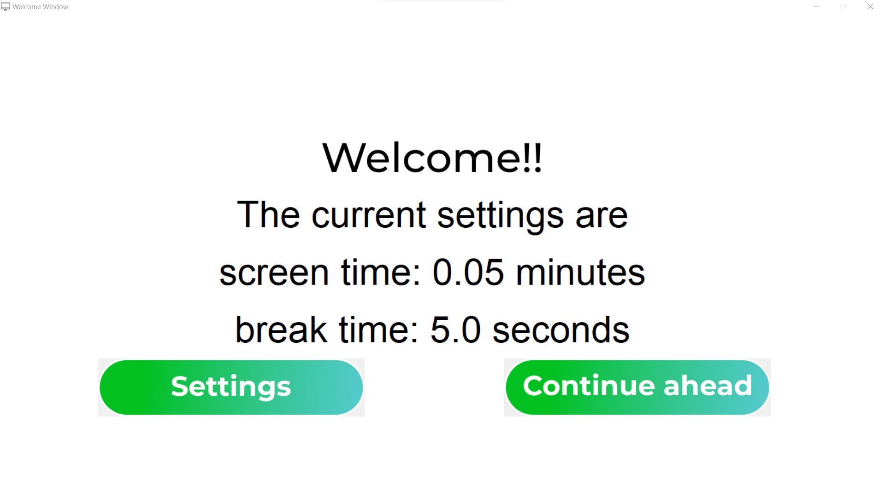

# Term 2 Project (20-20-20 rule)

Before starting with the introduction about the project, let's talk about why the project??
The 20-20-20 rule was designed by Californian optometrist Jeffrey Anshel as an easy reminder to take breaks and prevent eye strain, according to the Optometry Times. When following the rule, a person takes a 20-second break from looking at a screen every 20 minutes. Focusing on the same we decided to keep it 
steep and instead made a project to input the active and sleep time which will you know ahead following around the project. 

First step```$git clone https://github.com/Col-Asy/project-11-Term2.git```
___
Intalling the dependencies ```$pip install tkinter```
___
Inline-style: 


## Contributors
`Ayush Barnwal`
`Mohak Malhotra`
`Mudit Bhardwaj`